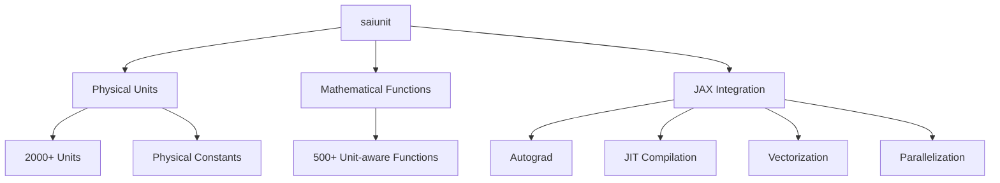

# `SAIUnit`: Enabling Unit-aware Computations for AI-driven Scientific Computing


<p align="center">
  	
</p> 


<p align="center">
	<a href="https://pypi.org/project/saiunit/"></a>
	<a href="https://github.com/chaobrain/saiunit/blob/main/LICENSE"></a>
    <a href='https://saiunit.readthedocs.io/en/latest/?badge=latest'>
        
    </a>  	
    <a href="https://badge.fury.io/py/saiunit"></a>
    <a href="https://github.com/chaobrain/saiunit/actions/workflows/CI.yml"></a>
    <a href="https://pepy.tech/projects/saiunit"></a>
</p>


## Motivation


[``saiunit``](https://github.com/chaobrain/saiunit) provides physical units and unit-aware mathematical system in JAX for brain dynamics and AI4Science. 

It is initially designed to enable unit-aware computations in brain dynamics modeling (see our [ecosystem](https://ecosystem-for-brain-dynamics.readthedocs.io/)).

However, its features and capacities can be applied to general domains in scientific computing and AI for science. 
We also provide ample examples and tutorials to help users integrate ``saiunit`` into their projects 
(see [Unit-aware computation ecosystem](#unit-aware-computation-ecosystem) in the below).


## Features


The uniqueness of ``saiunit`` lies in that it brings physical units handling and AI-driven computation together in a seamless way:

- It provides over 2,000 commonly used physical units and constants.
- It implements over 500 unit-aware mathematical functions.
- Its physical units and unit-aware functions are fully compatible with JAX, including autograd, JIT, vecterization, parallelization, and others.




A quick example:

```python

import saiunit as u

# Define a physical quantity
x = 3.0 * u.meter
x
# [out] 3. * meter

# autograd
f = lambda x: x ** 3
u.autograd.grad(f)(x)
# [out] 27. * meter2 


# JIT
import jax
jax.jit(f)(x)
# [out] 27. * klitre

# vmap
jax.vmap(f)(u.math.arange(0. * u.mV, 10. * u.mV, 1. * u.mV))
# [out]  ArrayImpl([  0.,   1.,   8.,  27.,  64., 125., 216., 343., 512., 729.],
#                  dtype=float32) * mvolt3
```


## Installation

You can install ``saiunit`` via pip:

```bash
pip install saiunit --upgrade
```

## Documentation

The official documentation is hosted on Read the Docs: [https://saiunit.readthedocs.io](https://saiunit.readthedocs.io)


## Unit-aware computation ecosystem


`saiunit` has been deeply integrated into following diverse projects, such as:

- [``brainstate``](https://github.com/chaobrain/brainstate): A State-based Transformation System for Program Compilation and Augmentation
- [``braintaichi``](https://github.com/chaobrain/braintaichi): Leveraging Taichi Lang to customize brain dynamics operators
- [``braintools``](https://github.com/chaobrain/braintools): The Common Toolbox for Brain Dynamics Programming.
- [``dendritex``](https://github.com/chaobrain/dendritex): Dendritic Modeling in JAX
- [``pinnx``](https://github.com/chaobrain/pinnx): Physics-Informed Neural Networks for Scientific Machine Learning in JAX.


Other unofficial projects include:

- [``diffrax``](https://github.com/chaoming0625/diffrax): Numerical differential equation solvers in JAX.
- [``jax-md``](https://github.com/Routhleck/jax-md): Differentiable Molecular Dynamics in JAX
- [``Catalax``](https://github.com/Routhleck/Catalax): JAX-based framework to model biological systems
- ...


## See also the BDP ecosystem

We are building the [brain dynamics programming ecosystem](https://ecosystem-for-brain-dynamics.readthedocs.io/). 
[``saiunit``](https://github.com/chaobrain/saiunit) has been deeply integrated into our BDP ecosystem.
